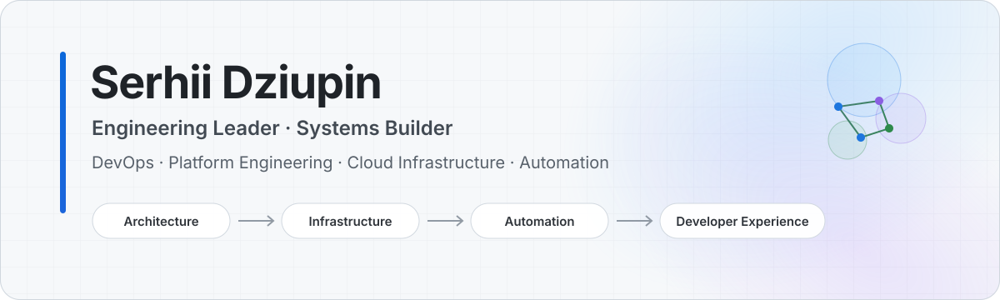

<picture>
  <source media="(prefers-color-scheme: dark)" srcset="./assets/profile-dark.svg">
  <source media="(prefers-color-scheme: light)" srcset="./assets/profile-light.svg">
  
</picture>

 

**Hands-on engineering across infrastructure, platforms, automation, developer experience, and reliable production systems.**

I work comfortably between architecture, implementation, and technical leadership — from Linux and networking to cloud platforms and engineering teams.

 

---

## Engineering focus

<table>
<tr>
<td width="25%" valign="top">

**Platform Engineering**

Production platforms, container orchestration, virtualization, self-hosted infrastructure.

</td>
<td width="25%" valign="top">

**Cloud & DevOps**

Cloud architecture, infrastructure as code, CI/CD, migrations, operational automation.

</td>
<td width="25%" valign="top">

**Reliability**

Observability, monitoring, repeatable operations, failure recovery, pragmatic system design.

</td>
<td width="25%" valign="top">

**Developer Systems**

Developer experience, internal tooling, workflow automation, LLM and agent integrations.

</td>
</tr>
</table>

> I like systems that are simple to operate, easy to understand, observable by default, and heavily automated.

---

## Experience

<table>
<tr>
<td width="145" valign="top"><strong>2022 — present</strong></td>
<td valign="top">
<strong>Senior DevOps Contractor · GoDaddy</strong> 
Supporting automation and cloud transformation across hosting and mailbox platforms, with hands-on work in infrastructure, migrations, delivery automation, reliability, and reducing operational complexity.
</td>
</tr>
<tr>
<td width="145" valign="top"><strong>2020 — present</strong></td>
<td valign="top">
<strong>Co-Founder & Technology Lead · Ikrapka</strong> 
Leading technology strategy and platform architecture for socially impactful initiatives focused on accessibility, public safety, and digital services. The role spans technical direction, architecture, hands-on engineering, and partnership development.
</td>
</tr>
<tr>
<td width="145" valign="top"><strong>2013 — present</strong></td>
<td valign="top">
<strong>CEO · Co-Founder · Solutions Architect · MakeIT.technology</strong> 
Co-founded and led an automation-first technology company delivering cloud, infrastructure, and software solutions for SMEs and enterprise customers. Combined business leadership with hands-on systems architecture, infrastructure automation, engineering practices, and delivery.
</td>
</tr>
<tr>
<td width="145" valign="top"><strong>2012 — 2019</strong></td>
<td valign="top">
<strong>Co-Founder & CTO · GPS-Ukraine</strong> 
Co-founded and built an IoT / fleet-management SaaS platform from concept to a production system serving hundreds of enterprise customers. Owned technical direction across system architecture, infrastructure, platform operations, and product engineering.
</td>
</tr>
</table>

---

## Core stack

<table>
<tr>
<td valign="top" width="50%">

### Infrastructure & Platform

`Linux` · `Docker` · `Kubernetes` · `k3s` · `Proxmox`  
`Terraform` · `Ansible` · `CI/CD` · `GitHub Actions`

</td>
<td valign="top" width="50%">

### Cloud & Networking

`AWS` · `Google Cloud` · `Cloudflare` · `WireGuard`  
Reverse proxies · DNS & networking · Self-hosted infrastructure

</td>
</tr>
<tr>
<td valign="top" width="50%">

### Software & Automation

`Python` · `PowerShell` · `Bash` · APIs  
Automation tooling · Arduino / embedded experiments

</td>
<td valign="top" width="50%">

### Observability & Systems

`Prometheus` · `Grafana` · metrics & telemetry  
Reliability engineering · developer tooling · LLM / agent integrations

</td>
</tr>
</table>

---

## How I build

- **Automate repetitive work** instead of documenting how to repeat it.
- **Prefer simple, observable systems** over clever infrastructure.
- **Treat developer experience as architecture**, not polish added later.
- **Design for failure and recovery**, not only for the happy path.
- **Stay hands-on** even when the work is architecture or leadership.

---

## Certifications

  
  

---

<strong>Architecture · Infrastructure · Automation · Engineering Leadership</strong>

