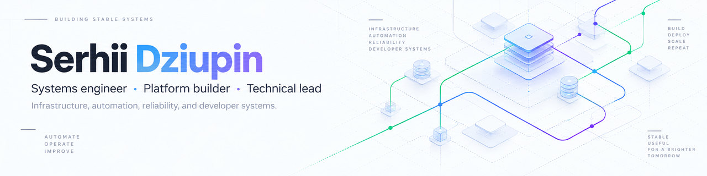

<picture>
  <source media="(prefers-color-scheme: dark)" srcset="./assets/profile-hero-dark-2026.jpg">
  <source media="(prefers-color-scheme: light)" srcset="./assets/profile-hero-light-2026.jpg">
  
</picture>

 

**Systems engineer, platform builder, technical lead.**

I work where infrastructure, automation, developer experience, and product engineering meet.  
Most of my work is about making complicated systems easier to **run, understand, debug, and change**.

 

  
  
  
  
  
  
  
  
  

---

## Focus

<table>
<tr>
<td width="50%" valign="top">

### Platform & infrastructure
Production platforms, container environments, virtualization, networking, and self-hosted systems.

</td>
<td width="50%" valign="top">

### Automation & delivery
Infrastructure as code, CI/CD, migrations, operational tooling, and reducing repetitive work.

</td>
</tr>
<tr>
<td width="50%" valign="top">

### Reliability & observability
Monitoring, telemetry, failure recovery, and systems that stay understandable under pressure.

</td>
<td width="50%" valign="top">

### Technical leadership
Architecture, technical direction, engineering practices, and hands-on delivery.

</td>
</tr>
</table>

> I like systems that are simple to operate, observable by default, and heavily automated.

---

## Experience

| Period | Role |
|---|---|
| **2022 — present** | **Senior DevOps Contractor · GoDaddy** Cloud transformation, infrastructure automation, migrations, delivery systems, and reliability across hosting and mailbox platforms. |
| **2020 — present** | **Co-Founder & Technology Lead · Ikrapka** Technology strategy and platform architecture for accessibility, public-safety, and digital-service initiatives. |
| **2013 — present** | **Co-Founder · CEO · Solutions Architect · MakeIT.technology** Built and led an automation-first technology company delivering infrastructure, cloud, and software systems for SME and enterprise customers. |
| **2012 — 2019** | **Co-Founder & CTO · GPS-Ukraine** Built an IoT and fleet-management SaaS platform from the ground up, from architecture and infrastructure to production operations and product engineering. |

---

## Toolbox

<table>
<tr>
<td width="50%" valign="top">

### Infrastructure

`Linux` · `Docker` · `Kubernetes` · `k3s` · `Proxmox`  
`Terraform` · `Ansible` · `GitHub Actions`

</td>
<td width="50%" valign="top">

### Cloud & networking

`AWS` · `Google Cloud` · `Cloudflare` · `WireGuard`  
DNS · reverse proxies · private networking

</td>
</tr>
<tr>
<td width="50%" valign="top">

### Automation

`Python` · `PowerShell` · `Bash` · APIs  
CI/CD · internal tooling · workflow automation

</td>
<td width="50%" valign="top">

### Observability & systems

`Prometheus` · `Grafana` · telemetry  
Developer tooling · LLM / agent integrations

</td>
</tr>
</table>

---

## How I build

- Automate the repeated operation, not the instructions for repeating it.
- Prefer a small operational surface area and obvious failure modes.
- Make systems observable before they become difficult to operate.
- Treat developer experience as part of architecture.
- Stay hands-on when the role becomes architectural or managerial.

---

## Certifications

  
  

Architecture · Infrastructure · Automation · Engineering Leadership
